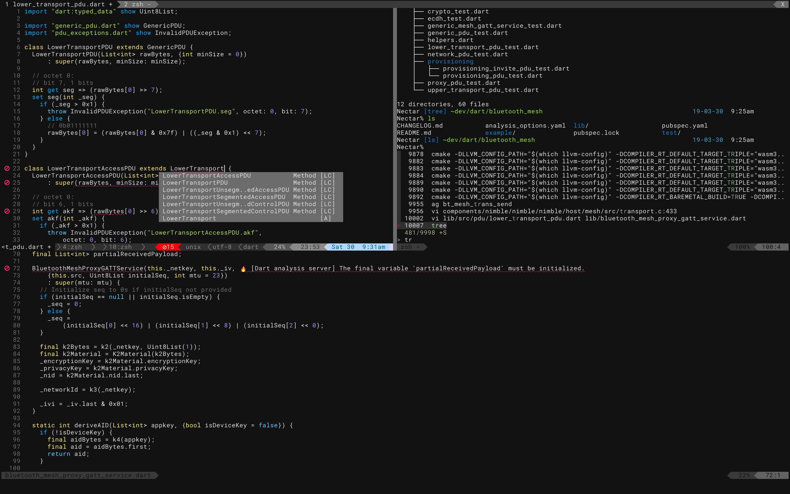

# Dependencies
```
# Debian/apt-get
# llvm
cat << EOF > /etc/apt/sources.list.d/llvm.list
deb http://apt.llvm.org/bionic/ llvm-toolchain-bionic-8 main
deb-src http://apt.llvm.org/bionic/ llvm-toolchain-bionic-8 main
EOF
# neovim
sudo apt-get install software-properties-common
sudo add-apt-repository ppa:neovim-ppa/stable
sudo apt-get install abduco ccache clang-tools-8 cmake colordiff cppcheck curl direnv distcc flawfinder git htop neovim ninja python3-pip redshift rpl rsync screen shellcheck silversearcher-ag sl tree wdiff zsh
sudo pip3 install neovim-remote black isort yapf
# fzf
git clone --depth 1 https://github.com/junegunn/fzf.git ~/.fzf
~/.fzf/install

# macOS/homebrew
/usr/bin/ruby -e "$(curl -fsSL https://raw.githubusercontent.com/Homebrew/install/master/install)"
brew install abduco arp-scan black ccache ccat cmake colordiff cppcheck direnv distcc flawfinder fzf htop neovim ninja openssl@1.1 llvm clang-format pinentry-mac python3 rpl shellcheck sl ssh-copy-id the_silver_searcher tree wdiff zsh
sudo pip3 install neovim-remote isort yapf

# Windows/Chocolatey
@"%SystemRoot%\System32\WindowsPowerShell\v1.0\powershell.exe" -NoProfile -InputFormat None -ExecutionPolicy Bypass -Command "iex ((New-Object System.Net.WebClient).DownloadString('https://chocolatey.org/install.ps1'))" && SET "PATH=%PATH%;%ALLUSERSPROFILE%\chocolatey\bin"
choco install ag autohotkey git kitty llvm neovim quicklook wox wsl wsl-debiangnulinux

```

# Install script (creates symlinks to dotfiles)
```
git clone http://github.com/paulreimer/dotfiles
./dotfiles/install.sh
```

# Download Individual Config files
```
## dotfiles
test -f ".gitconfig" || curl --silent -L "https://dotfiles.p-rimes.net/gitconfig" -o ".gitconfig"
test -f ".htoprc" || curl --silent -L "https://dotfiles.p-rimes.net/htoprc" -o ".htoprc"

## zsh
test -f ".zlogin" || curl --silent -L "https://dotfiles.p-rimes.net/zlogin" -o ".zlogin"
test -f ".zshrc" || curl --silent -L "https://dotfiles.p-rimes.net/zshrc" -o ".zshrc"
test -d ".zsh/plugins/zsh-syntax-highlighting" || git clone https://github.com/zsh-users/zsh-syntax-highlighting.git ".zsh/plugins/zsh-syntax-highlighting"

## vim/nvim
test -f ".vimrc" || curl --silent -L "https://dotfiles.p-rimes.net/vimrc" -o ".vimrc"
test -f ".config/nvim/init.vim" || curl --create-dirs --silent -L "https://dotfiles.p-rimes.net/init.vim" -o ".config/nvim/init.vim"
test -d ".vim" || curl -fLo .vim/autoload/plug.vim --create-dirs \
  https://raw.githubusercontent.com/junegunn/vim-plug/master/plug.vim
command -v nvim && nvim +'PlugInstall --sync' +qa

# machine-specific configuration
## (this is a macOS current workstation default):
#test -f ".zshenv" || curl --silent -L "https://dotfiles.p-rimes.net/zshenv_macos" -o ".zshenv"
## (this is a linux/BSD host default):
#test -f ".zshenv" || curl --silent -L "https://dotfiles.p-rimes.net/zshenv" -o ".zshenv"
```

# Screenshot (kitty/nvim/fzf)

